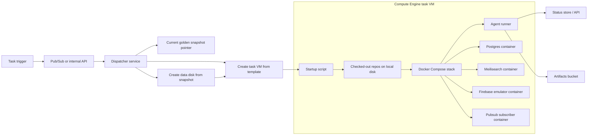

# Agentic Runner Compute Engine VM Option v1

## Purpose

Design a simpler GCP-native agentic runner using Compute Engine VMs instead of GKE pods and PVC cloning.

This option is meant to preserve the same core behavior:

- start from a known seeded data state
- run the full Docket local stack
- allow the agent to edit mutable checked-out code
- isolate one task from another
- optionally expose short-lived review URLs for the app and API

while reducing orchestration complexity.

## Why This Option Exists

The GKE/PVC design is strong, but it is also operationally heavier.

A Compute Engine VM maps more directly to how your system already works:

- one machine
- Docker Compose
- local filesystem mounts
- mutable checked-out repos
- one task owning one whole environment

That is a better fit for your current stack than trying to force everything into Kubernetes primitives from the start.

## Design Index

Detailed docs for this option:

- [System Diagram](./System-Diagram.md)
- [Infrastructure Setup and Terraform](./Infrastructure-Setup-and-Terraform.md)
- [Golden State and Disk Strategy](./Golden-State-and-Disk-Strategy.md)
- [VM Lifecycle and Orchestration](./VM-Lifecycle-and-Orchestration.md)
- [Task and Status Model](./Task-and-Status-Model.md)
- [Security and Secrets](./Security-and-Secrets.md)
- [Ephemeral Public Environments](./Ephemeral-Public-Environments.md)

Related comparison:

- [GKE PVC Option Overview](../gke-pvc-option/Agentic-Runner-System-v1.md)

## Core Recommendation

If the goal is the fastest path to a real working system, prefer:

- one ephemeral VM per task
- one boot image or instance template for the runtime
- one attached data disk created from a golden snapshot
- one startup script that clones repos and launches Docker Compose

## High-Level Architecture

## Why It Is Simpler

Compared to the GKE option, this removes:

- pods and sidecar orchestration
- init containers
- PVC and `VolumeSnapshot` object handling
- namespace cleanup logic
- Kubernetes API object churn for every task

You still need orchestration, but the control plane becomes:

- create one disk from snapshot
- create one VM
- let the VM run Docker Compose
- delete the VM and disk when done

## Runtime Model

Inside the VM:

- the boot disk holds runtime tools and checked-out repos
- the attached data disk holds seeded Postgres and Meilisearch state plus Firebase export data
- Docker Compose launches the local stack
- the runner edits the same checked-out `docket` repo that Firebase and pubsub mount

## Recommended v1 Topology

Each task VM runs:

- `agent-runner`
- `postgres`
- `meilisearch`
- `firebase`
- `pubsub-subscriber`
- app/API services
- a local edge proxy when public preview URLs are enabled

The simplest interpretation is:

- use Docker Compose as the runtime supervisor
- keep repo checkouts on the VM filesystem
- mount the repo and data paths into the relevant containers

## Golden State Strategy

This option still benefits from the same seeded-state concept as the GKE design.

Recommended split:

- boot image or instance template for software
- data disk snapshot for seeded state

That means:

- Postgres and Meilisearch read preinitialized data from the attached data disk
- Firebase imports export data from the attached data disk
- repos are cloned fresh onto the VM at startup

## Mutable Repo Requirement

The Docket repo is live runtime input, not just source code.

Required behavior:

- VM startup checks out `docket` and `docket-platform`
- Firebase mounts the checked-out `docket` repo at `/opt/docket`
- pubsub subscriber mounts the same `docket` repo at `/opt/docket`
- the runner edits that same checkout in place

This is much easier to reason about on a VM filesystem than in a pod with multiple volume types.

## Control Plane Recommendation

Use a small dispatcher service, likely on Cloud Run, that:

1. reads the current snapshot pointer
2. creates a new persistent disk from that snapshot
3. creates a VM from an instance template
4. attaches the cloned data disk
5. passes task metadata through instance metadata or a startup-script payload

For human-reviewable ephemeral environments, add one stable public ingress path:

- wildcard preview DNS and certificate
- external HTTPS load balancer
- Cloud Run preview gateway
- private routing from the gateway to each task VM's internal edge proxy

This avoids creating or mutating load balancer resources for every task VM.

## Suggested Task Flow

1. task is submitted
2. dispatcher creates data disk from the current golden snapshot
3. dispatcher creates VM from instance template
4. startup script mounts the data disk
5. startup script clones repos
6. startup script renders environment/config
7. startup script launches Docker Compose
8. startup script publishes preview readiness if public URLs are enabled
9. runner executes the task if the environment is in agentic mode
10. runner uploads artifacts and final status
11. control plane deletes VM and disk when the task or review TTL ends

## Key Tradeoffs

### Advantages

- closer to your existing local mental model
- simpler repo mount behavior
- simpler seeded-data attachment model
- easier to debug initially

### Disadvantages

- less elegant multi-tenant scheduling than GKE
- coarser resource packing
- potentially slower parallel scaling later
- more VM-level operational work if the system grows significantly

## Recommended v1 Scope

Start with:

- one VM template
- one current snapshot pointer
- one Docker Compose task stack
- one dispatcher path
- one task status store
- one preview gateway path for app/API URLs

Defer:

- autoscaling fleets
- managed instance groups
- advanced image baking
- multiple snapshot channels
- unauthenticated external-review links

## First Implementation Sequence

1. provision shared infrastructure with Terraform
2. create one base VM image or instance template
3. create the golden data disk and snapshot flow
4. build a dispatcher that creates a disk and VM per task
5. implement startup script and Compose runtime
6. add status persistence and artifact upload
7. add cleanup and failure handling

## Summary

The Compute Engine VM option is the simplest serious design that still respects your actual runtime constraints.

It keeps the two hard parts you really do need:

- seeded state
- mutable shared code mounts

and removes a lot of the Kubernetes-specific machinery that is otherwise required to express them.
