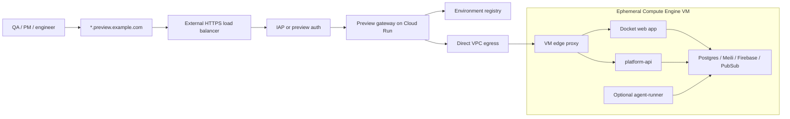

# Ephemeral Public Environments

## Purpose

Extend the Compute Engine VM option so the same seeded Docket stack can be used in two modes:

- agentic work mode, where an agent edits and verifies code
- review environment mode, where QA, PMs, or engineers manually test a branch without an agent process doing development

The missing capability is a short-lived public URL for:

- the Docket web application
- `platform-api`

## Core Recommendation

Use one stable public ingress layer and route dynamically to ephemeral task VMs.

Recommended shape:



In v1, avoid creating or mutating Google Cloud load balancer resources for each environment.

Instead:

- Terraform creates one long-lived HTTPS entrypoint
- Cloud DNS maps a wildcard preview domain to that entrypoint
- Certificate Manager provides a wildcard certificate
- a small Cloud Run gateway receives all preview traffic
- the gateway maps request hostnames to the current task VM's internal IP
- each VM runs a local edge proxy that forwards to the correct Compose service

## URL Shape

Use one wildcard level so one certificate and one DNS wildcard cover both services.

Example:

```text
https://task-2026-03-15-001-app.preview.example.com
https://task-2026-03-15-001-api.preview.example.com
```

Hostname parsing:

```text
{environment_id}-{service}.preview.example.com
```

Where:

- `environment_id` identifies the task or preview environment
- `service` is `app` or `api`

Avoid this shape in v1:

```text
https://app.task-2026-03-15-001.preview.example.com
https://api.task-2026-03-15-001.preview.example.com
```

That shape uses multiple wildcard levels and complicates certificate coverage.

## Why Not Per-VM Public IPs

A direct public IP on each VM is simpler mechanically, but it is a weaker default:

- every VM becomes directly internet reachable
- TLS and DNS provisioning become per-environment lifecycle concerns
- access control is harder to centralize
- cleanup failures can leave reachable machines behind

Use direct VM public IPs only as a short POC shortcut.

The v1 architecture should keep task VMs private and expose them only through the preview ingress path.

## Why Not Per-Environment Load Balancer Backends

Google Cloud load balancing can target Compute Engine VMs through instance groups or zonal NEGs. Zonal `GCE_VM_IP_PORT` NEGs are granular enough to point at a specific VM IP and port.

However, routing `task-a-app.preview.example.com` to VM A and `task-b-app.preview.example.com` to VM B means creating or updating runtime load balancer routing state per environment, such as:

- NEGs or NEG endpoints
- backend services
- URL map host rules
- health checks or backend associations

That is possible, but it adds control-plane churn to the hot path.

For this system, the VM lifecycle is already the runtime primitive. Keep the cloud ingress stable and make environment routing an application-level concern.

## Shared Infrastructure

Terraform should add:

- public Cloud DNS managed zone or delegated preview subdomain
- wildcard DNS record for `*.preview.example.com`
- Certificate Manager wildcard certificate for `*.preview.example.com`
- external HTTPS load balancer
- serverless NEG pointing to the preview gateway Cloud Run service
- optional IAP on the gateway backend
- Cloud Run preview gateway service
- Direct VPC egress or Serverless VPC Access for the gateway
- firewall rule allowing gateway egress subnet traffic to VM preview ports
- environment registry storage, likely Firestore

The load balancer and certificate are long-lived shared resources.

They are not created per task.

## Layer Ownership

Think of the preview path as three layers with separate ownership:

1. ingress
2. gateway
3. environment records

### Ingress Layer

The ingress layer is stable public Google Cloud infrastructure.

It is responsible for:

- accepting public HTTPS traffic
- terminating TLS
- applying global access controls such as IAP
- forwarding every preview request to the same gateway service

Request path:

```text
https://task-2026-03-15-001-app.preview.example.com
        |
        v
Cloud DNS wildcard record
        |
        v
External HTTPS load balancer
        |
        v
IAP or equivalent auth
        |
        v
Cloud Run preview gateway
```

Terraform owns this layer.

Starting a new preview environment should not create or mutate:

- DNS records
- TLS certificates
- forwarding rules
- URL maps
- backend services
- load balancer health checks

Every preview hostname lands at the same Cloud Run gateway.

### Gateway Layer

The gateway layer is dynamic application-level routing.

It is responsible for:

- translating a public hostname into an environment ID and service name
- enforcing per-environment access rules
- checking readiness and TTL
- proxying to the current VM internal IP
- producing clear responses when an environment is missing, booting, expired, or stopped

The gateway does not need to know the full Docker Compose topology.

It only needs:

- environment ID
- service name, such as `app` or `api`
- VM internal IP
- VM edge proxy port
- status
- expiration
- access rules

### Environment Record Layer

The environment record is the source of truth for dynamic routing.

It is used by:

- dispatcher, which creates the initial record
- VM startup, which marks the environment ready
- gateway, which reads the record to route requests
- cleanup worker, which expires and deletes cloud resources

Per environment, runtime operations create:

- one VM
- one cloned data disk
- one environment record

They should not create per-environment public networking resources.

## Preview Gateway

The preview gateway is a small HTTP reverse proxy.

Responsibilities:

1. parse the incoming hostname
2. authenticate the user or validate a short-lived preview token
3. look up the environment record
4. reject expired, deleted, or not-ready environments
5. proxy the request to the VM edge proxy over the VPC
6. preserve enough headers for app/API behavior
7. return clear `404`, `410`, or `503` responses for missing, expired, or booting environments

Suggested upstream target:

```text
http://{vm_internal_ip}:8080
```

Example request flow:

```text
GET https://task-2026-03-15-001-api.preview.example.com/v1/invoices

1. gateway reads Host:
   task-2026-03-15-001-api.preview.example.com

2. gateway parses:
   environment_id = task-2026-03-15-001
   service = api

3. gateway loads:
   environments/task-2026-03-15-001

4. gateway validates:
   status is ready
   expires_at is in the future
   requester is allowed
   requested service is enabled

5. gateway proxies:
   http://10.20.4.18:8080/v1/invoices
```

The gateway should preserve:

- `Host`
- `X-Forwarded-Host`
- `X-Forwarded-Proto`
- `X-Forwarded-For`
- request path and query string

If the app or API needs WebSockets or server-sent events, the gateway implementation must support streaming proxy behavior. Keep the Cloud Run request timeout high enough for expected manual testing sessions.

Gateway response behavior:

- `404` when the hostname does not map to a known environment
- `403` when the user or token is not allowed
- `410` when the environment is expired or intentionally deleted
- `503` when the environment exists but is still booting or not healthy
- proxied upstream status codes once the environment is ready

The gateway may cache environment records briefly to reduce Firestore reads, but the cache TTL should be short enough that stop/expire operations take effect quickly.

## VM Edge Proxy

Each task VM should run a local edge proxy as part of Docker Compose.

Recommended options:

- Caddy
- Traefik
- Nginx

Responsibilities:

- listen on one fixed internal port, such as `8080`
- route app hostnames to the Docket web service
- route API hostnames to `platform-api`
- expose readiness endpoints for the gateway and startup script

Example routing:

```text
*-app.preview.example.com -> docket-web:3000
*-api.preview.example.com -> platform-api:8080
```

The VM edge proxy does not need public TLS.

TLS terminates at the external HTTPS load balancer.

## Runtime Modes

Add an explicit mode to task/environment requests.

Recommended modes:

- `agentic`
- `review`

### Agentic Mode

Starts:

- seeded stack
- app/API services
- preview edge proxy if public URLs are requested
- agent runner

Use this when the agent needs to edit, run, and verify code. Public URLs are useful for observing the agent's final environment or debugging failures.

### Review Mode

Starts:

- seeded stack
- app/API services
- preview edge proxy

Does not start:

- agent runner

Use this when the goal is a human-reviewable ephemeral environment for a branch, PR, or candidate patch.

## Request Model Additions

Add optional preview fields to the task request:

```json
{
  "task_id": "task-2026-03-15-001",
  "mode": "review",
  "repo_app": "git@bitbucket.org:org/docket.git",
  "repo_api": "git@bitbucket.org:org/docket-platform.git",
  "base_branch_app": "feature/invoice-filter",
  "base_branch_api": "feature/invoice-filter",
  "enable_public_urls": true,
  "ttl_minutes": 240,
  "preview_access": {
    "type": "iap",
    "allowed_principals": [
      "group:qa@example.com",
      "user:pm@example.com"
    ]
  }
}
```

For `agentic` mode, `prompt` remains required.

For `review` mode, `prompt` should be optional or absent.

## Environment Registry

Persist enough information for gateway routing and cleanup.

Suggested fields:

```json
{
  "environment_id": "task-2026-03-15-001",
  "mode": "review",
  "status": "ready",
  "zone": "us-central1-a",
  "instance_name": "agent-task-2026-03-15-001",
  "vm_internal_ip": "10.20.4.18",
  "edge_proxy_port": 8080,
  "public_urls": {
    "app": "https://task-2026-03-15-001-app.preview.example.com",
    "api": "https://task-2026-03-15-001-api.preview.example.com"
  },
  "allowed_principals": [
    "group:qa@example.com",
    "user:pm@example.com"
  ],
  "created_at": "2026-03-15T09:00:00Z",
  "expires_at": "2026-03-15T13:00:00Z",
  "ready_at": "2026-03-15T09:04:00Z"
}
```

This can live in the same Firestore-backed task/status model.

Recommended record states:

- `launching`: dispatcher accepted the request and is creating cloud resources
- `booting`: VM exists and startup script is running
- `starting_stack`: Compose services are starting
- `ready`: app/API readiness checks have passed and gateway may proxy traffic
- `stopping`: an operator or timeout has requested teardown
- `expired`: TTL has elapsed
- `failed`: startup or runtime failed before the environment became usable
- `deleted`: cloud resources have been removed

The gateway should only proxy for `ready` environments.

For all other states, it should return a deterministic status instead of attempting a best-effort upstream connection.

## Lifecycle Changes

The dispatcher should:

1. accept either an agentic task request or a review environment request
2. create the cloned data disk
3. create the VM
4. pass mode and preview settings through instance metadata
5. create an environment registry record with `status = "launching"`
6. compute public URLs immediately and store them in status

The VM startup script should:

1. mount the data disk
2. clone repos and check out requested branches
3. render environment config
4. start the seeded stack
5. start app/API services
6. start the local edge proxy
7. start the agent runner only when `mode = "agentic"`
8. call the status API when app and API readiness checks pass

The gateway should:

- return `503` until the environment is marked ready
- begin proxying when the registry record contains `status = "ready"`
- return `410` after expiration

The cleanup worker should:

- delete expired VMs and disks
- mark expired registry records as `expired`
- keep enough final metadata for audit and artifact lookup

End-to-end lifecycle:

```text
1. user requests review environment for a branch or PR
2. dispatcher creates the cloned data disk
3. dispatcher creates the VM
4. dispatcher writes environment record with status = launching
5. dispatcher computes public app/API URLs immediately
6. VM boots, clones repos, and starts Compose
7. VM starts app, API, and local edge proxy
8. VM readiness checks app and API
9. VM updates environment record with status = ready
10. QA/PM opens the public app URL
11. gateway validates the request and proxies to the VM
12. TTL expires or user stops the environment
13. cleanup deletes VM and disk
14. environment record is marked expired or deleted
15. old URLs return 410
```

## Access Control

Default recommendation:

- put IAP in front of the preview gateway
- restrict access by Google Workspace users or groups
- still enforce per-environment authorization in the gateway

The gateway should not rely only on obscurity of URLs.

For external reviewers who cannot use IAP, support a separate later mode:

- short-lived signed preview token
- token hash stored in the environment record
- token scoped to one environment
- token expiration no later than the environment TTL

Do not make unauthenticated previews the default.

## Application Configuration

The app and API need generated environment variables that match their public preview URLs.

Examples:

```text
APP_PUBLIC_URL=https://task-2026-03-15-001-app.preview.example.com
PLATFORM_API_PUBLIC_URL=https://task-2026-03-15-001-api.preview.example.com
```

Also set any CORS, callback, websocket, or cookie-domain values needed by the Docket app and API.

Prefer exact per-environment origins over broad wildcard CORS.

## Operational Behavior

Recommended defaults:

- preview TTL: 4 hours
- maximum TTL: 24 hours
- idle timeout: optional later optimization
- VM without external IP by default
- one edge proxy port exposed only to the gateway's VPC egress range
- public URLs visible in the task/environment status page

The environment should be extendable by an authorized operator, but extension should update `expires_at` explicitly.

## Cost Impact

The main added fixed costs are:

- one external HTTPS load balancer
- one Cloud Run gateway service
- one wildcard certificate
- DNS zone if not already present
- optional Serverless VPC Access connector if Direct VPC egress is not used

Per-environment cost remains dominated by:

- one Compute Engine VM
- one cloned data disk

This preserves the cost shape of the Compute Engine VM option.

## First Implementation Sequence

1. Delegate `preview.example.com` or create a project-specific preview subdomain.
2. Provision wildcard DNS, wildcard certificate, HTTPS load balancer, and preview gateway.
3. Add gateway-to-VPC connectivity and firewall rules to private VM preview ports.
4. Add VM edge proxy service to Compose.
5. Add `agentic` and `review` modes to task startup metadata.
6. Add public URL fields to task/environment status.
7. Add readiness reporting from VM startup.
8. Add TTL cleanup and expired-environment gateway behavior.

## Recommendation

Add this to the Compute Engine VM stack.

It complements the VM option rather than changing its core design:

- the seeded stack still runs on one ephemeral VM
- Docker Compose remains the runtime supervisor
- agentic work and human review use the same environment primitive
- public access is centralized through one stable ingress path

## References

- [External Application Load Balancer overview](https://cloud.google.com/load-balancing/docs/https/)
- [Zonal network endpoint groups overview](https://cloud.google.com/load-balancing/docs/negs/zonal-neg-concepts)
- [Cloud Run VPC egress options](https://docs.cloud.google.com/run/docs/configuring/connecting-vpc)
- [IAP with external Application Load Balancers](https://cloud.google.com/iap/docs/load-balancer-howto)
- [Cloud DNS records overview](https://cloud.google.com/dns/docs/records-overview)
- [Certificate Manager certificates](https://cloud.google.com/certificate-manager/docs/certificates)
