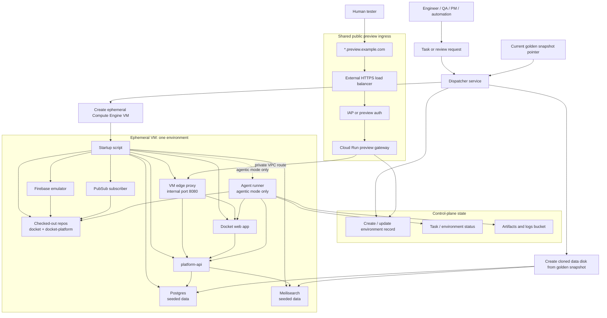
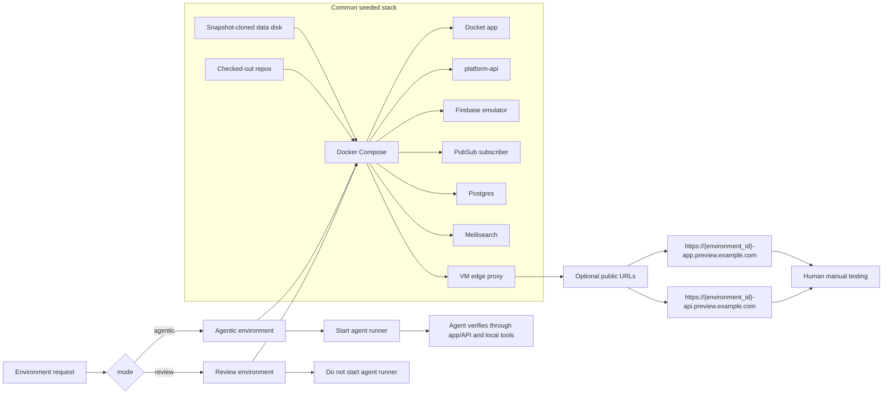
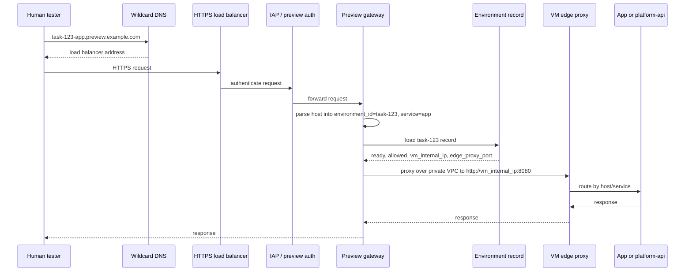
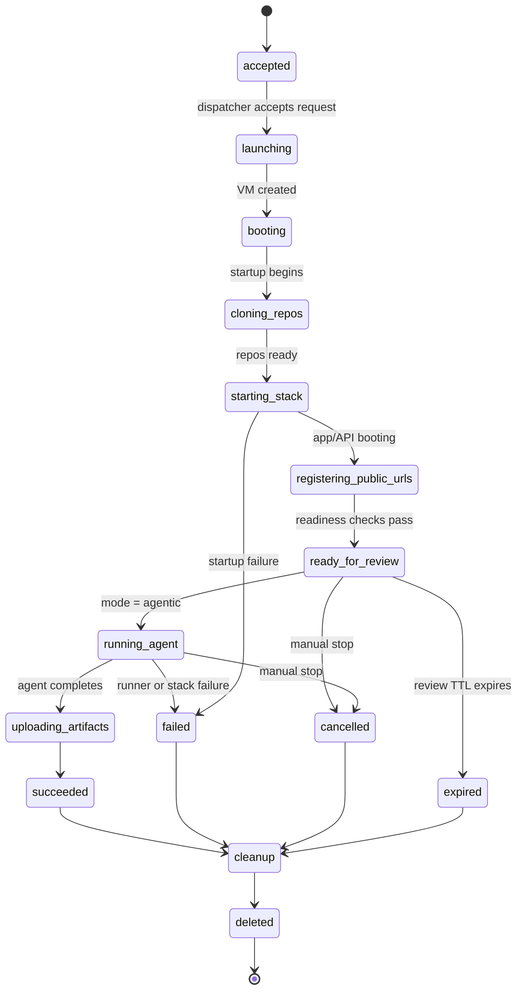

# Compute Engine Runner System Diagram

## Purpose

Visualize the Compute Engine VM design with both supported runtime modes:

- `agentic`: an agent works inside the environment and can use the same app/API preview URLs for verification
- `review`: the seeded stack runs without an agent so QA, PMs, or engineers can manually test a branch or PR

## High-Level Architecture

## Mode Split

## Request Routing

## Environment Lifecycle

## Key Design Point

The environment is dynamic, but the public cloud ingress is stable.

Per environment, the system creates:

- one VM
- one cloned data disk
- one environment record

It does not create per-environment DNS records, certificates, load balancer backends, or public IPs.
