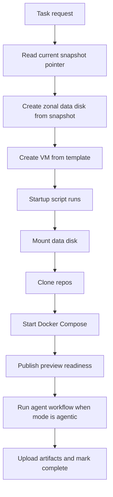

# VM Lifecycle and Orchestration

## Purpose

Define how one task request becomes one running Compute Engine VM and how that VM boots the local stack.

## Core Recommendation

Use a dispatcher service to create:

1. one persistent disk from the current golden snapshot
2. one VM from an instance template
3. instance metadata containing task-specific startup inputs

Then let the VM startup script prepare the workspace and launch Docker Compose.

If public preview URLs are enabled, the VM also starts a local edge proxy and reports app/API readiness to the status store.

## Dispatch Flow



## Dispatcher Responsibilities

- validate task payload
- select snapshot name
- create data disk from snapshot
- create VM with attached data disk
- pass task metadata through instance metadata
- record instance name and disk name in task status

## Suggested VM Metadata Inputs

- `task_id`
- `task_prompt`
- `repo_app`
- `repo_api`
- `base_branch_app`
- `base_branch_api`
- `artifacts_prefix`
- `status_api_url`
- `mode`
- `enable_public_urls`
- `preview_base_domain`
- `ttl_minutes`

## Startup Script Responsibilities

The startup script should:

1. mount the attached data disk
2. create a workspace directory
3. clone `docket` and `docket-platform`
4. render any task-specific env/config files
5. render a task-specific compose file or env file
6. start Docker Compose
7. start the VM edge proxy if public URLs are enabled
8. report app/API readiness
9. launch or signal the runner process when `mode = "agentic"`

## Recommended Filesystem Layout

```text
/srv/runner
  /workspace
    /docket
    /docket-platform
  /run
    /logs
    /artifacts
  /compose
/mnt/golden
  /postgres/pgdata
  /meilisearch/data
  /firebase/export
```

## Compose Runtime

Recommended Compose services:

- `postgres`
- `meilisearch`
- `firebase`
- `pubsub-subscriber`
- `docket-web`
- `platform-api`
- `preview-edge`
- `agent-runner` when `mode = "agentic"`

App/API can either:

- run inside the `agent-runner` container as child processes
- or become separate Compose services later

For v1, app/API can be coordinated by the startup script or by the runner in agentic mode.

In review mode, the agent runner should not start. The environment exists only for manual verification.

## Key Mounts

### Firebase

- mounts `/srv/runner/workspace/docket` to `/opt/docket`
- mounts `/mnt/golden/firebase/export` to the import path

### Pubsub Subscriber

- mounts `/srv/runner/workspace/docket` to `/opt/docket`
- runs `node /opt/docket/functions/utils/devPubSubscriber.js`

### Agent Runner

- mounts the whole workspace
- mounts logs/artifacts directories

### Preview Edge Proxy

- listens on one fixed internal port, such as `8080`
- routes `*-app.preview.example.com` to the Docket web service
- routes `*-api.preview.example.com` to `platform-api`
- exposes health checks for app and API readiness

### Postgres and Meilisearch

- mount the corresponding seeded data paths from `/mnt/golden`

## Why This Works Better for Your Stack

The VM behaves like a stable local machine:

- repo checkouts live on a normal filesystem
- Docker Compose manages the local system
- Firebase and pubsub see the same mutable checkout the agent edits

That is much closer to your current local behavior than the pod-volume model.

## Task Completion

When an agentic task finishes:

1. runner uploads artifacts
2. runner writes final status
3. control plane deletes the VM
4. control plane deletes the task data disk if not auto-deleted with the instance

When a review environment is ready:

1. startup writes public app/API URLs to status
2. humans test through the preview gateway
3. control plane deletes the VM and disk when `expires_at` is reached or the environment is manually stopped

Important:

- do not assume the attached cloned data disk will clean itself up

## Failure Handling

### Startup Script Failure

If repo clone or compose startup fails:

- VM should still upload or expose logs if possible
- task should be marked failed

### Runtime Failure

If the runner or Compose services crash:

- status should be updated
- logs should be collected

### Cleanup Failure

If VM deletion succeeds but disk deletion does not:

- an orphan reaper process should remove old task disks by label and age

## Summary

The orchestration model for the VM option is deliberately simple:

- create disk
- create VM
- let startup script bootstrap the machine
- run Docker Compose
- delete everything when done
