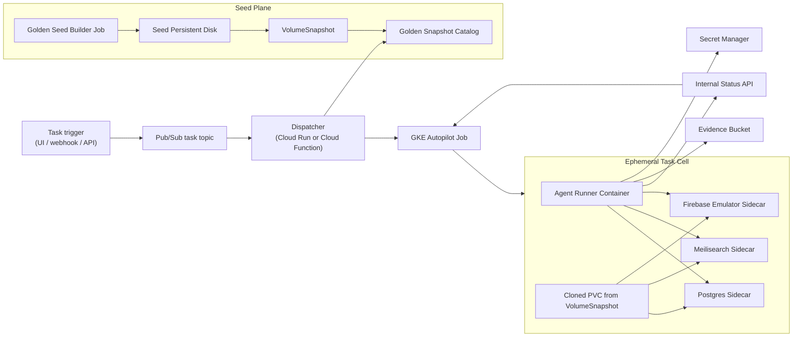

# Agentic Runner System v1

## Purpose

Design a GCP-native agentic task runner that can:

- start from a known, high-fidelity Docket state,
- launch isolated task environments quickly,
- run agentic tools against the full local stack,
- report progress and artifacts back to the control plane,
- terminate cleanly without polluting future runs.

This document consolidates the six prior conversation files into a single working design and ties that design back to the current Docket local stack and the earlier "golden copy container" approach.

## Design Index

This document is the system overview. Detailed subsystem designs live here:

- [Infrastructure Setup and Terraform](./Infrastructure-Setup-and-Terraform.md)
- [Golden Seed Pipeline](./Golden-Seed-Pipeline.md)
- [Task Dispatcher and Job Spec](./Task-Dispatcher-and-Job-Spec.md)
- [Runner Boot Lifecycle](./Runner-Boot-Lifecycle.md)
- [Repo Bootstrap and Init Container](./Repo-Bootstrap-and-Init-Container.md)
- [Snapshot Catalog Schema](./Snapshot-Catalog-Schema.md)
- [Task and Status Model](./Task-and-Status-Model.md)
- [Security and Secrets](./Security-and-Secrets.md)

## Current Local Reference

The current local environment in `docket/docker-compose.yml` establishes the baseline stack we want the cloud runner to reproduce:

- Postgres
- Meilisearch
- Firebase emulator
- PubSub subscriber process
- app code mounted from the repo

One important local behavior must carry forward into the cloud design:

- the Firebase emulator container runs against mutable checked-out Docket source,
- specifically the `docket/functions` code mounted into the container,
- and the agent may edit that code during the task.

The earlier `docket/golden` flow proves the core requirement: we already know how to capture a useful seeded state for:

- Firebase export data
- PostgreSQL data
- Meilisearch data

The new design keeps that idea but changes the packaging model:

- Old model: bake seeded state into container images.
- New model: build a seeded persistent disk once, snapshot it, and clone from that snapshot per task.

## Design Principles

1. Each task gets a private environment. No shared mutable data between tasks.
2. Task startup must avoid replaying the full seed pipeline.
3. The runtime should preserve the Docket local topology closely enough that agent fixes transfer back to real development.
4. Seed creation is a separate pipeline from task execution.
5. Golden state must be versioned, inspectable, and replaceable.
6. Cancellation and cleanup are first-class lifecycle concerns.

## Non-Goals

- Replacing product/design preview environments.
- Building a generic multitenant preview platform.
- Supporting arbitrary long-lived developer workspaces in v1.
- Solving every repository boot optimization in the first iteration.

## Top-Level Architecture



## System Boundaries

### Seed Plane

The seed plane is responsible for producing and publishing a canonical golden state. It is expensive, infrequent, and controlled.

### Task Plane

The task plane is responsible for running one agent task in one isolated cell. It is fast, ephemeral, and horizontally scalable.

### Control Plane

The control plane receives task requests, chooses a golden state version, launches task jobs, tracks status, and handles cancellation.

## Moving Pieces

## 1. Task Request Model

Every task should resolve to a normalized request payload before it reaches GKE.

Recommended v1 fields:

```json
{
  "task_id": "task-2026-03-14-001",
  "task_type": "bugfix",
  "requested_by": "user-or-system",
  "repo_app": "git@bitbucket.org:org/docket-app.git",
  "repo_api": "git@bitbucket.org:org/docket-platform.git",
  "base_branch_app": "main",
  "base_branch_api": "main",
  "prompt": "Investigate failing invoice search behavior",
  "snapshot_channel": "nightly",
  "snapshot_version": null,
  "priority": "normal",
  "compute_profile": "standard",
  "timeout_minutes": 90,
  "artifacts_prefix": "gs://bucket/agent-runs/task-2026-03-14-001/"
}
```

Notes:

- `snapshot_channel` lets the dispatcher choose a known branch of golden state, such as `nightly`, `release-candidate`, or `manual-debug`.
- `snapshot_version` can override channel-based selection for reproducibility.
- `compute_profile` lets the dispatcher vary CPU and memory without changing the task contract.

## 2. Task Control Plane

### Recommended Components

- Task producer: internal API, webhook receiver, or operator UI.
- Pub/Sub topic: durable queue between task creation and execution.
- Dispatcher service: converts a task message into Kubernetes resources.
- Status API: receives progress events and task completion.
- Cancellation API: deletes running jobs by task id.

### Recommendation

Use a small dispatcher service as the "job factory." Cloud Run is slightly better than Cloud Functions for this role because:

- it is easier to package with Kubernetes client libraries,
- it is easier to add retries and structured logging,
- it can evolve into a richer API surface without changing platforms.

Cloud Functions is still viable if you want the narrowest first cut.

## 3. Golden State Builder Pipeline

This is the core system that replaces the current baked-image approach.

### Responsibilities

1. Create a blank persistent disk for a new seed build.
2. Mount that disk into a seed builder job.
3. Populate it with the canonical Docket data layout.
4. Validate the resulting stack.
5. Shut services down cleanly.
6. Create a `VolumeSnapshot`.
7. Publish metadata for later task selection.

### Recommended Build Frequency

- Nightly by default.
- On-demand manual builds for incident reproduction or branch-specific state.

### Recommended Inputs

- Seed script version
- Source environment or export bundle
- Docket code revision used to prepare the data
- Postgres image version
- Meilisearch image version
- Firebase emulator image/tooling version

### Recommended Outputs

- GKE-compatible `VolumeSnapshot`
- Metadata record in a snapshot catalog
- Validation report
- Optional evidence bundle in GCS

## 4. Golden Volume Layout

The seeded disk should have an explicit filesystem layout so each sidecar mounts only what it needs.

Recommended layout:

```text
/seed
  /postgres/pgdata
  /meilisearch/data
  /firebase/export
  /metadata/seed-manifest.json
  /metadata/validation-report.json
```

### Why this layout

- Postgres can mount `/seed/postgres/pgdata` directly as `PGDATA`.
- Meilisearch can mount `/seed/meilisearch/data` directly as `/meili_data`.
- Firebase emulator can mount `/seed/firebase/export` and start with `--import=/seed/firebase/export`.
- Metadata stays on the same cloned volume for debugging and provenance.

### Important Design Choice

Do not treat every service the same at seed time.

Recommended v1 behavior:

- Postgres: store pre-initialized runtime data files on disk.
- Meilisearch: store pre-initialized runtime data files on disk.
- Firebase emulator: store exported emulator data and import it on boot.

Reasoning:

- Postgres and Meilisearch gain the most startup speed from raw on-disk seeded state.
- Firebase emulator is better treated via its export/import contract than as a raw durable database.

## 5. Golden Snapshot Catalog

The dispatcher needs a stable way to choose the correct snapshot.

Recommended metadata fields:

```json
{
  "snapshot_id": "golden-2026-03-14-nightly-01",
  "channel": "nightly",
  "status": "ready",
  "created_at": "2026-03-14T06:30:00Z",
  "source_revision": {
    "docket": "abc123",
    "docket_platform": "def456"
  },
  "seed_version": "seed-runner-v3",
  "storage": {
    "volume_snapshot_name": "golden-2026-03-14-nightly-01",
    "size_gib": 100
  },
  "runtime_compatibility": {
    "postgres_image": "postgis/postgis:17-3.5-alpine",
    "meilisearch_image": "getmeili/meilisearch:v1.5",
    "firebase_image": "servicecore/docket-firebase:20.20.1-v2"
  },
  "validation": {
    "status": "passed",
    "checks": [
      "postgres-ready",
      "meilisearch-ready",
      "firebase-import-valid"
    ]
  }
}
```

Recommended storage options:

- Firestore if you want fast operational convenience.
- PostgreSQL if you want stronger relational querying.
- A simple GCS manifest file if you want the smallest first implementation.

Recommendation: start with Firestore or a GCS manifest and keep the schema minimal.

## 6. Ephemeral Task Cell

Each task runs as one Kubernetes Job that creates one isolated pod and one cloned PVC.

### Pod Shape

- `agent-runner` container
- `postgres` sidecar
- `meilisearch` sidecar
- `firebase-emulator` sidecar
- `pubsub-subscriber` sidecar

### Why a Single Pod

- Containers share localhost networking.
- The runtime topology matches local development more closely.
- Cleanup is simpler because one job owns the whole cell.

### Shared Volumes

- `golden-clone` PVC cloned from the selected `VolumeSnapshot`
- `workspace` emptyDir for checked out repos and generated files
- `scratch` emptyDir for logs, temporary files, screenshots, and bundles

Important distinction:

- `golden-clone` holds seeded runtime data,
- `workspace` holds mutable source checkouts,
- and the Firebase emulator must consume code from `workspace`, not from the golden snapshot.

## 7. Kubernetes Resource Model

The dispatcher should create:

1. A PVC cloned from the selected `VolumeSnapshot`
2. A Job referencing that PVC
3. Labels and annotations tying both resources back to `task_id`

Recommended labels:

- `agent-runner/task-id`
- `agent-runner/snapshot-id`
- `agent-runner/requested-by`
- `agent-runner/compute-profile`

Recommended job behavior:

- `backoffLimit: 0` for deterministic task failure
- `ttlSecondsAfterFinished` for cleanup after artifacts are uploaded
- `activeDeadlineSeconds` derived from task timeout

## 8. Agent Runner Container

The runner container is the coordinator. It should not hold seeded data itself.

### Responsibilities

1. Read task metadata from env vars or a mounted task spec.
2. Wait for sidecars to become healthy.
3. Fetch repo credentials from Secret Manager.
4. Clone the required repositories into the workspace volume.
5. Start the app and API processes.
6. Run readiness checks against the local stack.
7. Execute the agent toolchain.
8. Stream heartbeats and milestone updates.
9. Package logs and evidence.
10. Push code and create PRs if configured.
11. Exit with a meaningful status code.

### Internal Process Layout

Recommended workspace layout:

```text
/workspace
  /app
  /api
  /run
    /logs
    /artifacts
    /reports
```

### Boot Sequence

1. Load task config.
2. Wait for Postgres and Meilisearch to be healthy.
3. Start Firebase emulator and verify import success if not already running.
4. Clone repos.
5. Install dependencies if needed.
6. Start the API process.
7. Start the app process.
8. Verify HTTP readiness.
9. Invoke the agent command.
10. Upload artifacts.
11. Publish final status.

## 9. Sidecar Details

### Postgres

- Mount cloned PVC subpath `/seed/postgres/pgdata` to `/var/lib/postgresql/data`
- Use the exact Postgres major version the seed builder used
- Prefer clean shutdown before snapshot capture to avoid recovery surprises

### Meilisearch

- Mount cloned PVC subpath `/seed/meilisearch/data` to `/meili_data`
- Keep the Meilisearch version pinned to snapshot metadata
- Validate that a task cell can start without rebuilding indexes

### Firebase Emulator

- Mount cloned PVC subpath `/seed/firebase/export`
- Mount the checked-out Docket repo or `functions` subtree from the shared `workspace` volume
- Start emulator with explicit `--import` path
- Treat import/export data as the compatibility boundary, not internal emulator storage

This means the Firebase emulator is partly data-coupled to the golden snapshot and partly code-coupled to the mutable workspace.

Recommended mount model:

- checkout `docket` to `/workspace/docket`
- mount `/workspace/docket` into the Firebase container at `/opt/docket`
- let the emulator read `/opt/docket/functions` exactly as the local Docker Compose setup does

### PubSub Subscriber

- Mount the checked-out Docket repo from the shared `workspace` volume
- Run the equivalent of the local `devPubSubscriber.js` process against that mutable checkout
- Treat this sidecar as required system behavior, not optional task-specific behavior

Because the subscriber is code-coupled to the Docket checkout, it shares the same mutable workspace requirement as the Firebase emulator.

## 10. Security and Identity

### GCP Access

Use Workload Identity so task pods can access:

- Secret Manager
- GCS evidence bucket
- optional internal APIs

### Git Access

Store Bitbucket SSH keys or app credentials in Secret Manager.

Recommended v1 flow:

1. Runner fetches SSH key from Secret Manager at boot.
2. Runner writes it to an in-memory or scratch location with strict permissions.
3. Runner configures Git and SSH for that process.
4. Runner deletes the local key material during teardown.

### Isolation

- No shared writable persistent storage between tasks.
- Separate service account for seed builder vs task runner.
- Namespace task jobs into a dedicated cluster namespace.

## 11. Status, Telemetry, and Artifacts

### Status Model

The runner should emit lifecycle states such as:

- `accepted`
- `booting`
- `cloning_snapshot`
- `starting_sidecars`
- `cloning_repos`
- `starting_stack`
- `running_agent`
- `uploading_artifacts`
- `succeeded`
- `failed`
- `cancelled`

### Heartbeats

Send heartbeat updates every 30 to 60 seconds with:

- task id
- current state
- short status message
- timestamps
- optional progress estimate

### Artifacts

Upload to GCS:

- runner logs
- app/API logs
- screenshots
- test results
- final summary payload
- optional git diff bundle

## 12. Cancellation and Cleanup

Cancellation should be implemented at the Kubernetes Job level.

Recommended behavior:

1. Control plane marks the task `cancelling`.
2. Control plane deletes the Kubernetes Job.
3. Runner traps `SIGTERM` and uploads best-effort final logs.
4. Kubernetes removes the pod.
5. PVC is deleted after job completion or by an explicit cleanup controller.

Important detail:

The PVC lifecycle must be tied to the task lifecycle. Do not leave cloned disks behind on failure paths.

## 13. Failure Domains

### Seed Build Failures

- Incomplete or invalid golden state
- Snapshot created from unclean service shutdown
- Version mismatch between seed build and task runtime image

Mitigation:

- Validation before publishing snapshot as `ready`
- Snapshot metadata pins runtime image versions
- Promote snapshots in stages: `building` -> `validating` -> `ready`

### Task Launch Failures

- PVC clone failure
- Sidecar crashloop
- repo clone auth failure
- app/API boot failure
- agent tool failure

Mitigation:

- explicit stage-level status reporting
- structured runner exit codes
- logs and validation artifacts uploaded on failure

## 14. Migration From the Current Golden Image Approach

Current approach in `docket/golden`:

- Firebase export copied into an image
- PostgreSQL dump baked into an image and restored at first boot
- Meilisearch snapshot baked into an image and imported at boot

Recommended migration path:

1. Keep the same logical source data.
2. Stop baking the seed into runtime images.
3. Create a seed-builder job that writes those assets into a dedicated persistent disk.
4. For Postgres and Meilisearch, move from import-at-boot to pre-initialized on-disk runtime data.
5. For Firebase, keep import-at-boot from the cloned disk export folder.

This migration preserves the valuable part of the old system, which is the seeded content, while removing the costly part, which is image-based packaging for every change.

## 15. Recommended v1 Scope

Build the first version around one repeatable path:

- one snapshot channel: `nightly`
- one compute profile: `standard`
- one task type: repository-backed bugfix/investigation
- one evidence bucket layout
- one namespace in one GKE Autopilot cluster

Defer these until after v1 works:

- multiple parallel snapshot channels
- branch-specific golden states
- autoscaling by task class
- richer lease-like reservation features
- long-lived interactive sessions

## 16. Open Questions

These are the decisions that still need to be locked down.

### Seed Source

What exactly produces the canonical seed data?

Options:

- replay from scripts against source systems
- import from a previously exported bundle
- restore from sanitized production-like backups

Recommendation: start from the existing seed-runner/export flow because it already reflects the Docket data shape.

### Repo Boot Strategy

Should each task run dependency install from scratch or use prebuilt dependency layers?

Recommendation: keep code checkout ephemeral, but optimize images so common tooling is preinstalled.

### App/API Packaging

Should the runner start both repos from source each time, or should one or both be prebuilt?

Recommendation: start from source in v1 to preserve debugging fidelity, then optimize after measuring boot time.

This recommendation is stronger for the Docket repo because the Firebase emulator must run against mutable branch code during the task.

### Cluster Topology

Single cluster vs dedicated runner cluster?

Recommendation: use a dedicated runner cluster or at least a dedicated namespace and quotas. Do not mix this blindly with unrelated workloads.

## 17. First Implementation Sequence

1. Provision shared infrastructure for the runner system with Terraform.
2. Validate cluster storage and snapshot support.
3. Write the golden volume manifest and seed-builder job spec.
4. Define the snapshot metadata schema and storage location.
5. Build the dispatcher that creates PVC + Job from a task payload.
6. Build the repo bootstrap/init-container flow.
7. Build the runner entrypoint and status protocol.
8. Launch a minimal task cell that starts Postgres, Meilisearch, Firebase, and the pubsub subscriber from the correct mounted inputs.
9. Add local app/API boot, artifact upload, cancellation handling, and PR integration.

## 18. Immediate Next Docs To Create

This document is the system overview. The next useful design docs are:

1. `Infrastructure-Setup-and-Terraform.md`
2. `Golden-Seed-Pipeline.md`
3. `Task-Dispatcher-and-Job-Spec.md`
4. `Runner-Boot-Lifecycle.md`
5. `Repo-Bootstrap-and-Init-Container.md`
6. `Snapshot-Catalog-Schema.md`
7. `Task-and-Status-Model.md`
8. `Failure-Modes-and-Operational-Runbook.md`

## Summary

The key architectural decision is now explicit:

- the golden state is built out-of-band,
- stored as a versioned disk snapshot,
- cloned into a private PVC for each task,
- consumed by a single-pod task cell that reproduces the Docket stack closely,
- and destroyed completely when the task ends.

That is the correct replacement for the earlier "golden container" model and gives you the right foundation for a real agentic runner rather than a generic ephemeral preview system.
