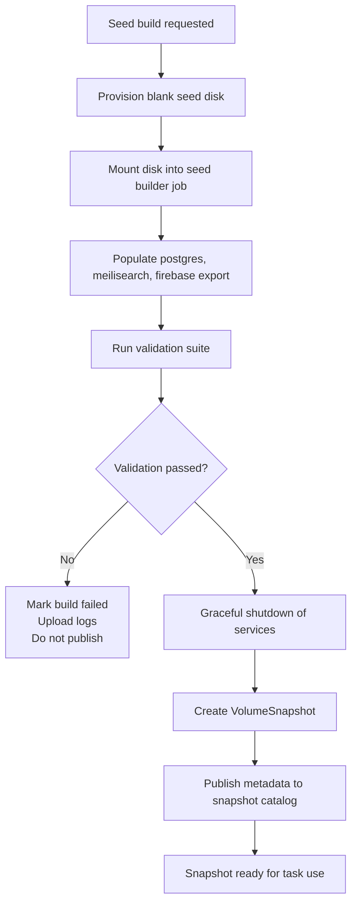

# Golden Seed Pipeline

## Purpose

Define how the system creates, validates, versions, and publishes the canonical golden state used by agent task cells.

This pipeline replaces the earlier "golden image" workflow with a storage-first workflow:

- build a seeded persistent volume,
- validate it,
- snapshot it,
- publish metadata,
- let task jobs clone from it.

## Scope

This document covers:

- seed inputs,
- build stages,
- disk layout,
- validation,
- snapshot publication,
- operational controls.

This document does not cover:

- the task dispatcher,
- the runtime runner lifecycle inside a task pod,
- the product/UI used to request runs.

## Goals

1. Produce a deterministic, reusable golden state for agent tasks.
2. Avoid replaying the full seed flow at task startup.
3. Keep seed creation auditable and reproducible.
4. Make failed seed builds impossible to promote accidentally.

## Inputs

The seed pipeline should record all material inputs used to create a golden snapshot.

Required inputs:

- seed pipeline version
- Docket repo revision
- Docket platform/API repo revision, if relevant
- source data bundle identifier
- Postgres image tag
- Meilisearch image tag
- Firebase emulator image tag
- environment variables or flags used during seeding

Optional inputs:

- snapshot channel, such as `nightly` or `manual-debug`
- requested organization or dataset profile
- sanitization manifest version

## Seed Artifact Contract

The output of the pipeline is not a container image. It is a validated volume snapshot plus metadata.

Required outputs:

- a persistent disk populated with seed data
- a `VolumeSnapshot`
- a metadata manifest
- a validation report
- optional logs and evidence in GCS

## High-Level Flow



## Seed Builder Runtime

Use a dedicated seed builder job, separate from task jobs.

Recommended characteristics:

- runs on GKE as a controlled Job
- uses a dedicated service account
- mounts one blank persistent disk
- writes a structured filesystem layout
- emits structured logs and machine-readable validation output

Reasoning:

- the build step is operationally different from task execution,
- it has stronger privileges,
- it may run longer,
- and it must never be confused with normal agent workloads.

## Filesystem Layout

Recommended disk layout:

```text
/seed
  /postgres/pgdata
  /meilisearch/data
  /firebase/export
  /metadata/seed-manifest.json
  /metadata/validation-report.json
  /logs/
```

### Layout Rules

- Postgres sidecar data must be fully initialized in `/seed/postgres/pgdata`.
- Meilisearch runtime data must exist in `/seed/meilisearch/data`.
- Firebase emulator export data must exist in `/seed/firebase/export`.
- Metadata must live on the disk itself so cloned task cells can introspect provenance.

## Stage Breakdown

## 1. Provision Stage

Create a blank persistent disk sized for the full runtime state plus growth margin.

Recommendations:

- start with a fixed size, such as 100 GiB, until usage data suggests otherwise,
- use the same storage class family intended for task PVC clones,
- label the disk with build id, channel, and source revision metadata.

## 2. Populate Stage

Populate the disk contents from the current seed source.

### v1 Recommendation

Base the initial implementation on the existing Docket seed/export flow rather than inventing a new source path.

That means reusing the existing logic that already produces:

- Firebase export data
- PostgreSQL contents
- Meilisearch contents

### Populate Substeps

1. Prepare directory structure on the mounted disk.
2. Start Postgres against `/seed/postgres/pgdata`.
3. Restore or materialize the seeded PostgreSQL dataset.
4. Start Meilisearch against `/seed/meilisearch/data`.
5. Import or rebuild seeded indexes.
6. Materialize Firebase emulator export data into `/seed/firebase/export`.
7. Write a manifest with exact source versions and timestamps.

### Important Distinction

For Postgres and Meilisearch, the goal is to leave behind ready-to-run runtime data directories.

For Firebase, the goal is to leave behind a valid export/import dataset, not a raw internal database directory.

## 3. Validate Stage

No snapshot may be published until the seed disk passes validation.

### Required v1 Validation Checks

- Postgres starts successfully using `/seed/postgres/pgdata`
- expected database exists
- a small set of smoke queries succeed
- Meilisearch starts successfully using `/seed/meilisearch/data`
- expected indexes exist
- at least one known document is queryable
- Firebase emulator accepts `--import=/seed/firebase/export`
- expected collections/documents are present after import
- metadata manifest exists and is well formed

### Validation Output

Write a machine-readable report to:

`/seed/metadata/validation-report.json`

Also upload a copy to GCS for operational visibility.

Suggested shape:

```json
{
  "build_id": "seed-2026-03-14-nightly-01",
  "status": "passed",
  "checks": [
    { "name": "postgres-ready", "status": "passed" },
    { "name": "meilisearch-ready", "status": "passed" },
    { "name": "firebase-import-valid", "status": "passed" }
  ],
  "started_at": "2026-03-14T05:00:00Z",
  "finished_at": "2026-03-14T05:21:00Z"
}
```

## 4. Quiesce Stage

Before taking the snapshot, the builder must shut services down cleanly.

Requirements:

- stop Postgres gracefully,
- stop Meilisearch cleanly,
- ensure all buffered writes are flushed,
- ensure the disk is in a consistent state.

This is especially important for Postgres, where crash recovery at task boot should be treated as a validation failure signal, not normal behavior.

## 5. Snapshot Stage

After validation and graceful shutdown, create a `VolumeSnapshot` from the populated disk.

Recommendations:

- name snapshots with a predictable convention,
- include channel and timestamp,
- attach labels matching the seed manifest,
- keep the snapshot immutable once published.

Suggested naming:

- `golden-nightly-2026-03-14-01`
- `golden-manual-debug-2026-03-14-auth-bug`

## 6. Publish Stage

Publishing means "this snapshot is selectable by the dispatcher."

Publishing should only happen after:

- population completed,
- validation passed,
- snapshot creation succeeded,
- metadata was stored successfully.

Recommended promotion states:

- `building`
- `validating`
- `snapshotting`
- `ready`
- `failed`

Only `ready` snapshots may be used for task launches.

## Snapshot Metadata

Minimum published metadata:

```json
{
  "snapshot_id": "golden-nightly-2026-03-14-01",
  "channel": "nightly",
  "status": "ready",
  "created_at": "2026-03-14T05:25:00Z",
  "disk_size_gib": 100,
  "source_revisions": {
    "docket": "abc123",
    "docket_platform": "def456"
  },
  "seed_inputs": {
    "seed_pipeline_version": "v1",
    "postgres_image": "postgis/postgis:17-3.5-alpine",
    "meilisearch_image": "getmeili/meilisearch:v1.5",
    "firebase_image": "servicecore/docket-firebase:20.20.1-v2"
  },
  "validation_status": "passed"
}
```

## Triggering Modes

### Nightly Build

Default production path. This keeps the task startup path simple and gives you one expected golden state per day.

### Manual Build

Used for incident reproduction, debugging, or controlled testing of a new seed flow.

### Branch-Specific Build

Not recommended for initial scope. It becomes attractive later if app/API schema drift creates compatibility pressure.

## Operational Policy

### Retention

Recommended initial retention:

- keep the latest 7 nightly snapshots,
- keep manually promoted debug snapshots until explicitly removed,
- delete failed build disks and failed snapshots quickly.

### Promotion

The task dispatcher should select:

- the newest `ready` snapshot in a channel, unless
- an explicit snapshot id is requested.

### Rollback

If a new nightly snapshot is bad:

- mark it unusable in the catalog,
- leave the previous `ready` snapshot available,
- do not force task jobs onto the new build.

## Failure Modes

### Source Data Failure

The pipeline cannot obtain or materialize the source data cleanly.

Outcome:

- build marked `failed`
- no snapshot published

### Validation Failure

The disk was populated, but one or more services do not start from it correctly.

Outcome:

- build marked `failed`
- logs and validation artifacts uploaded
- snapshot not published

### Metadata Publication Failure

The snapshot exists but the catalog was not updated.

Outcome:

- snapshot should remain effectively dark
- build marked `failed` or `incomplete`
- operator remediation required before use

## Security

- seed builder service account should be distinct from the task runner service account
- source data access should be limited to the builder
- task jobs should never be able to mutate published snapshots
- manual snapshot promotion should require elevated operational access

## Recommended v1 Implementation

1. Reuse the existing `seed-runner` logic as the data source mechanism.
2. Replace the final "build Docker images" step with "write to mounted disk."
3. Add a validation harness that boots each service from the written disk layout.
4. Add a publish step that creates a `VolumeSnapshot` and writes metadata to the catalog.

## Open Questions

### Source of Truth

Do you want the seed pipeline to derive from:

- exported local/dev state,
- sanitized production-like data,
- or a deterministic synthetic dataset?

The pipeline can support all three later, but v1 should pick exactly one.

### Schema Drift

How tightly should snapshots be pinned to app/API revisions?

Recommendation:

- record the revisions always,
- allow tasks to use a nearby code revision at first,
- tighten compatibility rules only after you see concrete breakage.

## Summary

The golden seed pipeline is a controlled manufacturing process. Its job is to produce one thing well:

- a validated, versioned, cloneable snapshot of the Docket runtime state.

Everything else in the agentic runner system depends on the quality of that artifact, so the pipeline must be strict about validation and promotion.
