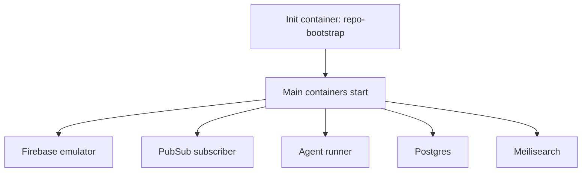

# Repo Bootstrap and Init Container

## Purpose

Define how task pods obtain the working copies of:

- `docket`
- `docket-platform`

and make those checkouts available to:

- the `agent-runner` container,
- the Firebase emulator sidecar,
- the pubsub subscriber sidecar,
- and any other code-coupled runtime process.

This document exists because the Docket repo is not just source code to edit. It is part of the live runtime for the task cell.

## Why This Matters

The local system relies on mutable checked-out code:

- the Firebase emulator container reads `docket/functions`
- the pubsub subscriber process runs from the same Docket checkout
- the agent may actively modify that code during the task

That means the cloud task cell cannot treat code checkout as a private concern of the runner alone. The repo checkout must be a shared runtime resource inside the pod.

## Design Goal

Create one shared mutable workspace per task pod, populated before the main containers start, so all runtime containers see the same checked-out files.

## Core Decision

Use an init container to bootstrap the repos into a shared `workspace` volume before the main containers start.

This is preferable to having the runner clone repos after the pod is already live because:

- Firebase needs the Docket checkout at startup
- the pubsub subscriber needs the Docket checkout at startup
- init containers provide an explicit and reliable ordering guarantee
- failure is clearer because the pod never reaches partial runtime startup

## Shared Volumes

Recommended pod volumes:

- `workspace` as `emptyDir` for mutable checkouts
- `scratch` as `emptyDir` for bootstrap logs and temporary files
- `golden-clone` PVC for seeded service data

Recommended directory layout:

```text
/workspace
  /docket
  /docket-platform
  /meta/bootstrap.json
  /meta/repos.json
```

## Pod Startup Order



The key point is simple:

- repo bootstrap must complete before Firebase and pubsub sidecars are allowed to start.

## Init Container Responsibilities

The init container should:

1. fetch Git credentials from Secret Manager
2. clone `docket` into `/workspace/docket`
3. clone `docket-platform` into `/workspace/docket-platform`
4. check out the requested branches
5. optionally pin to requested commits if later needed
6. write metadata about what was checked out
7. exit successfully or fail the pod startup

It should not:

- run the app
- run the API
- install all runtime dependencies unless required for startup correctness
- perform agent logic

## Inputs

Recommended env vars for the init container:

- `REPO_DOCKET`
- `REPO_DOCKET_PLATFORM`
- `BASE_BRANCH_DOCKET`
- `BASE_BRANCH_DOCKET_PLATFORM`
- `TASK_ID`

If you want to keep naming aligned with the broader docs, map:

- `REPO_APP` -> `docket`
- `REPO_API` -> `docket-platform`

but operationally the repo names matter here because the runtime mounts are path-specific.

## Bootstrap Output Contract

On success, the init container guarantees:

- `/workspace/docket` exists and is a usable Git checkout
- `/workspace/docket-platform` exists and is a usable Git checkout
- `/workspace/meta/bootstrap.json` exists
- `/workspace/meta/repos.json` exists

Suggested `repos.json`:

```json
{
  "task_id": "task-2026-03-14-001",
  "repos": {
    "docket": {
      "path": "/workspace/docket",
      "branch": "main",
      "commit": "abc123"
    },
    "docket_platform": {
      "path": "/workspace/docket-platform",
      "branch": "main",
      "commit": "def456"
    }
  }
}
```

## Mount Strategy

### Agent Runner

Mount the full workspace at `/workspace`.

The runner edits files in:

- `/workspace/docket`
- `/workspace/docket-platform`

### Firebase Emulator

Mount the Docket checkout at `/opt/docket`.

Recommended mapping:

- source: `workspace` volume
- mount path: `/opt/docket`
- subPath: `docket`

This makes `/opt/docket/functions` available exactly where the emulator expects it.

### PubSub Subscriber

Mount the Docket checkout at `/opt/docket`.

Recommended mapping:

- source: `workspace` volume
- mount path: `/opt/docket`
- subPath: `docket`

This lets the sidecar run the equivalent of:

`node /opt/docket/functions/utils/devPubSubscriber.js`

against the same mutable checkout the agent is editing.

### Docket Platform Runtime

The runner uses `/workspace/docket-platform` directly for the API-side repo.

If a future sidecar depends on it directly, mount it the same way using a `subPath`.

## Why Shared Mutable Checkout Is Correct

This pod design deliberately allows the runner, Firebase emulator, and pubsub subscriber to see the same files.

That means:

- code edits from the agent are immediately visible to sidecars
- runtime behavior matches the checked-out branch state
- debugging is closer to local development reality

The tradeoff is that runtime consistency depends on how well the sidecars handle file changes while running.

## Hot Reload and Restart Strategy

Open question: do Firebase emulator and the pubsub subscriber see changes automatically, or should the runner restart them after certain edits?

Recommended v1 assumption:

- do not rely on perfect hot reload
- if the task edits `docket/functions` in a way that should change emulator/subscriber behavior, the runner may trigger a controlled restart of those processes or the whole task cell may need restart semantics later

Since sidecars are separate containers, direct process restart from the runner is not trivial.

Recommended v1 handling:

- prefer changes that are picked up by the emulator naturally
- if process restart becomes necessary, model it as a known limitation and revisit sidecar supervision strategy

## Dependency Installation Strategy

There are two distinct concerns:

### Repo Availability

The init container must make the repos exist before the main containers start.

### Runtime Dependency Readiness

The runner may still need to run:

- package install
- build steps
- env setup

for the app and API after pod startup.

Recommendation:

- init container only guarantees checkout presence
- runner remains responsible for most dependency and runtime setup

Do not overload the init container with all runtime preparation unless a sidecar cannot start without it.

## Failure Modes

### Credential Fetch Failure

The init container cannot fetch Git credentials.

Outcome:

- pod startup fails immediately
- no main containers start

### Repo Clone Failure

One or both repos cannot be cloned.

Outcome:

- pod startup fails immediately
- bootstrap logs should be preserved in container logs and scratch space if possible

### Wrong Branch or Commit

The checkout succeeds but the requested ref is invalid.

Outcome:

- pod startup fails immediately

### Partial Checkout State

One repo cloned, the other did not.

Outcome:

- init container should fail
- partial workspace should not be treated as usable

## Security

- init container should use the same workload identity pattern as the runner for Secret Manager access, or receive credentials through a tightly scoped mechanism
- credentials must not be persisted into the shared workspace
- bootstrap metadata should record branches and commits but never secrets

## Example Pod Pattern

```yaml
initContainers:
  - name: repo-bootstrap
    image: us-docker.pkg.dev/project/agent-runner:latest
    command: ["/app/bootstrap-repos"]
    env:
      - name: REPO_DOCKET
        value: git@bitbucket.org:org/docket.git
      - name: REPO_DOCKET_PLATFORM
        value: git@bitbucket.org:org/docket-platform.git
      - name: BASE_BRANCH_DOCKET
        value: main
      - name: BASE_BRANCH_DOCKET_PLATFORM
        value: main
    volumeMounts:
      - name: workspace
        mountPath: /workspace
      - name: scratch
        mountPath: /scratch

containers:
  - name: agent-runner
    volumeMounts:
      - name: workspace
        mountPath: /workspace
  - name: firebase-emulator
    volumeMounts:
      - name: workspace
        mountPath: /opt/docket
        subPath: docket
      - name: golden-clone
        mountPath: /seed
  - name: pubsub-subscriber
    command: ["node", "/opt/docket/functions/utils/devPubSubscriber.js"]
    volumeMounts:
      - name: workspace
        mountPath: /opt/docket
        subPath: docket
```

## Recommended v1 Rules

1. Repos must be bootstrapped by an init container.
2. `docket` and `docket-platform` both live in the shared workspace.
3. Firebase emulator mounts the checked-out `docket` repo at `/opt/docket`.
4. Pubsub subscriber mounts the checked-out `docket` repo at `/opt/docket`.
5. The runner edits the same shared checkout seen by those sidecars.

## Summary

The repo bootstrap system is not just a convenience for the runner. It is part of the runtime contract of the task pod.

Without it:

- Firebase cannot start correctly against mutable branch code
- the pubsub subscriber cannot run correctly
- and the agent would be editing code that the live system is not actually using

With it:

- one task pod has one shared mutable code view,
- seeded data remains separate on the cloned volume,
- and the runtime matches the way your Docket stack actually behaves.
