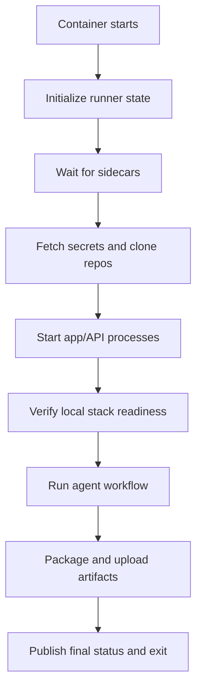

# Runner Boot Lifecycle

## Purpose

Define the lifecycle of the `agent-runner` container inside a task cell.

This document covers:

- startup sequencing,
- readiness checks,
- local process management,
- status emission,
- artifact handling,
- graceful shutdown.

## Runner Role

The runner is the coordinator for one task cell.

It is responsible for turning a launched pod into a usable working environment and then driving the agent task to completion.

It is not responsible for:

- creating Kubernetes resources,
- selecting snapshots,
- publishing new golden state.

## Inputs

The runner starts with:

- environment variables from the dispatcher
- a cloned golden volume mounted into sidecars
- workspace and scratch volumes
- a service account identity for GCP access

Minimum env vars:

- `TASK_ID`
- `TASK_PROMPT`
- `REPO_APP`
- `REPO_API`
- `BASE_BRANCH_APP`
- `BASE_BRANCH_API`
- `SNAPSHOT_ID`
- `ARTIFACTS_PREFIX`
- `STATUS_API_URL`

## High-Level Lifecycle



## Lifecycle Stages

The runner should emit explicit lifecycle states.

Recommended states:

- `booting`
- `starting_sidecars`
- `cloning_repos`
- `starting_stack`
- `running_agent`
- `uploading_artifacts`
- `succeeded`
- `failed`
- `cancelled`

## Stage 1: Initialization

Responsibilities:

- parse env vars
- validate required configuration
- prepare working directories
- initialize logging
- start heartbeat loop

Recommended directories:

```text
/workspace
  /app
  /api
  /run/logs
  /run/artifacts
  /run/reports
/scratch
```

Initialization should fail fast if required config is missing.

## Stage 2: Wait for Sidecars

The runner should not begin repo operations until the local services are usable.

### Required Checks

- Postgres accepts connections on localhost
- Meilisearch responds healthy on localhost
- Firebase emulator process is reachable if part of the task profile
- pubsub subscriber process is running and not crash looping

Recommended commands:

- `pg_isready`
- HTTP health check to Meilisearch
- HTTP or known emulator endpoint probe for Firebase
- process/container status check for the pubsub subscriber

### Timeout Behavior

Each sidecar should have:

- short retry interval
- overall stage timeout

If sidecar readiness fails:

- emit a failure state,
- capture quick diagnostics,
- exit non-zero.

## Stage 3: Fetch Credentials and Clone Repos

### Credentials Flow

1. Fetch Git credentials from Secret Manager.
2. Write them to a temporary file with strict permissions.
3. Configure `GIT_SSH_COMMAND` or `.ssh/config` for the current process.

### Clone Rules

- clone into `/workspace/app` and `/workspace/api`
- checkout the requested base branches
- capture commit SHAs in the run metadata

If only one repo is relevant for a task type, the other may be omitted.

For the Docket repo specifically:

- the checkout is also live runtime input for the Firebase emulator,
- so the shared workspace path must be stable for the whole pod lifetime,
- and edits made by the agent must happen in that shared location.

### Failure Handling

If clone or checkout fails:

- emit `failed`
- upload clone logs
- do not proceed to stack startup

## Stage 4: Prepare the Repos

Responsibilities:

- install dependencies if needed
- materialize env files or runtime config
- run lightweight setup required for local boot

### v1 Recommendation

Start from source checkout plus dependency install, because it matches development reality best.

Optimization can come later by:

- preinstalling common tooling in the runner image
- caching package manager stores
- moving some setup into layered images

Important nuance:

- if an init container bootstraps the repos before the pod starts, the runner should treat those checkouts as the canonical mutable working copies rather than recloning them elsewhere.

## Stage 5: Start Local Stack

The runner starts the local app and API processes and supervises them.

Recommended supervision model:

- one parent runner process
- child processes for app and API
- stdout/stderr redirected to structured log files under `/workspace/run/logs`

### Startup Sequence

1. Start API process.
2. Wait until API is healthy.
3. Start app process.
4. Wait until app is healthy.

The exact order can change if the frontend depends on the API at boot.

The Firebase emulator sidecar should already have access to the checked-out Docket repo through the shared `workspace` mount.

Operationally, that means:

- the runner edits `/workspace/docket/...`,
- the Firebase emulator sees the same files at `/opt/docket/...`,
- the pubsub subscriber sees the same files at `/opt/docket/...`,
- and if emulator/function hot reload is incomplete, the runner may need restart handling for the Firebase-related sidecars as part of the task workflow.

### Required Outputs

- PID tracking for each child process
- per-process log files
- readiness timestamps

## Stage 6: Local Readiness Verification

Before the agent begins work, the runner should verify a usable local environment.

Minimum checks:

- API health endpoint responds
- app dev server or preview server responds
- API can reach Postgres
- API can reach Meilisearch
- Firebase emulator can see the checked-out Docket functions code and starts cleanly from it
- pubsub subscriber is alive against the same checked-out Docket code

Optional checks:

- a simple smoke test against a key Docket workflow

If readiness fails:

- capture logs
- emit `failed`
- exit without invoking the agent workflow

## Stage 7: Run Agent Workflow

This is the point where Codex, Amp, or other tooling actually performs the task.

The runner should:

- write the task prompt to a local file for traceability
- record start and end timestamps
- stream milestone status updates
- capture tool stdout/stderr to files

Recommended artifact files:

- `/workspace/run/reports/task-prompt.txt`
- `/workspace/run/reports/agent-summary.json`
- `/workspace/run/logs/agent.stdout.log`
- `/workspace/run/logs/agent.stderr.log`

### Tool Contract

The runner should normalize the outputs expected from agent tools:

- exit code
- summary text
- optional diff or patch bundle
- optional test results

This avoids binding the whole platform too tightly to one agent binary.

## Stage 8: Artifact Packaging

Before exit, the runner should collect evidence.

Required artifacts:

- runner log
- app log
- API log
- agent stdout/stderr
- summary JSON

Optional artifacts:

- screenshots
- test reports
- coverage reports
- git diff bundle

### Packaging Strategy

- keep raw files on disk during execution
- produce one final bundle or structured directory upload at the end
- avoid compressing everything repeatedly during heartbeats

## Stage 9: Final Status and Exit

The runner should publish one terminal status:

- `succeeded`
- `failed`
- `cancelled`

Final payload should include:

- task id
- snapshot id
- final status
- short summary
- artifact location
- timing information
- optional output branch / PR link

Suggested shape:

```json
{
  "task_id": "task-2026-03-14-001",
  "snapshot_id": "golden-nightly-2026-03-14-01",
  "status": "succeeded",
  "summary": "Fixed invoice search regression and verified local smoke test.",
  "artifacts_prefix": "gs://bucket/agent-runs/task-2026-03-14-001/",
  "started_at": "2026-03-14T07:00:30Z",
  "finished_at": "2026-03-14T07:28:15Z"
}
```

## Heartbeats

Use a background heartbeat loop throughout execution.

Recommended heartbeat interval:

- every 30 to 60 seconds

Heartbeat fields:

- task id
- lifecycle state
- short message
- timestamp
- optional stage-local progress

Heartbeats should be best-effort. Temporary status API failures should not crash the task.

## Graceful Shutdown

The runner must handle cancellation and pod termination cleanly.

### On `SIGTERM`

1. mark local state as `cancelling`
2. stop accepting new agent work
3. ask child processes to terminate
4. upload best-effort logs and summary
5. emit terminal `cancelled` status if possible
6. exit promptly

### Child Process Shutdown

Recommended order:

1. stop app process
2. stop API process
3. allow sidecars to be terminated by pod shutdown

## Failure Modes

### Sidecar Never Ready

Likely causes:

- broken snapshot
- image/version mismatch
- mount path issue

Action:

- emit failure at `starting_sidecars`
- capture local diagnostics

### Repo Clone Failure

Likely causes:

- bad credentials
- wrong repo URL
- network problem

Action:

- emit failure at `cloning_repos`
- retain Git diagnostics

### Stack Boot Failure

Likely causes:

- dependency install problem
- missing env vars
- incompatible schema/state

Action:

- emit failure at `starting_stack`
- upload process logs

### Agent Execution Failure

Likely causes:

- tool crash
- exceeded task timeout
- unhandled repository state issue

Action:

- emit failure at `running_agent`
- upload tool logs and summary

## Observability

The runner should make troubleshooting easy even when the pod is already gone.

Recommendations:

- structured runner log with stage markers
- per-child-process logs
- explicit stage start/end timestamps
- summary JSON written locally before upload

## Recommended v1 Implementation Style

Use a single coordinator program or script with:

- clear stage functions,
- trap handling,
- child process supervision,
- best-effort artifact upload,
- status API helper methods.

Shell is possible, but Python or Node is more maintainable once:

- retries,
- JSON payloads,
- process supervision,
- and structured status updates

become important.

## Open Questions

### Runtime Dependency Install

Do you want to pay install time on every task for maximum fidelity, or move toward prebuilt workspace images faster?

Recommendation: measure before optimizing. Keep the lifecycle design stable either way.

### Agent Tool Contract

Will one runner binary invoke Codex directly, Amp directly, or support multiple backends via a common interface?

Recommendation: define a local "agent command contract" early so the rest of the runner stays stable.

## Summary

The runner lifecycle should be rigid and observable:

- wait for services,
- clone and prepare repos,
- boot the local stack,
- verify readiness,
- run the agent,
- upload evidence,
- exit cleanly.

That discipline is what turns a launched pod into a reliable task execution cell.
