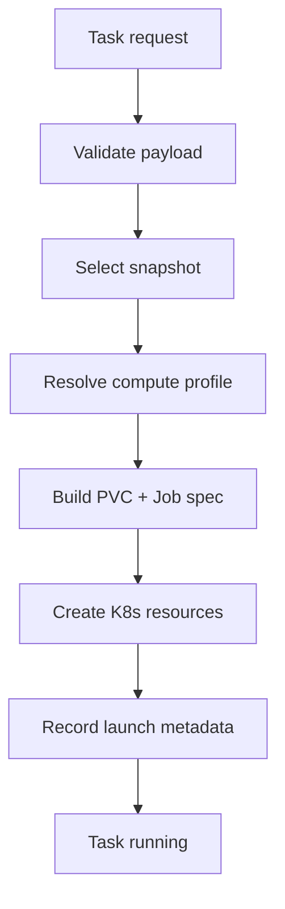

# Task Dispatcher and Job Spec

## Purpose

Define how a task request becomes an executable GKE workload.

This document covers:

- request normalization,
- snapshot selection,
- Kubernetes resource creation,
- status wiring,
- cancellation,
- resource cleanup.

## Dispatcher Role

The dispatcher is the system's job factory.

Responsibilities:

1. Receive or consume normalized task requests.
2. Validate required fields.
3. Select a usable golden snapshot.
4. Map task intent to a compute profile.
5. Create Kubernetes resources for one task cell.
6. Record task launch metadata.
7. Surface launch failures clearly.

The dispatcher should not:

- run agent logic,
- perform seed creation,
- hold long-lived mutable task state beyond launch metadata,
- or directly stream the task workload itself.

## Recommended Runtime

Prefer a small Cloud Run service over Cloud Functions for v1.

Reasoning:

- easier packaging of Kubernetes clients,
- easier control over concurrency and retries,
- easier evolution into an internal API.

Pub/Sub remains a good queueing mechanism even if the dispatcher runs on Cloud Run.

## Inputs

The dispatcher should consume a normalized task payload like:

```json
{
  "task_id": "task-2026-03-14-001",
  "task_type": "bugfix",
  "requested_by": "operator@company.com",
  "repo_app": "git@bitbucket.org:org/docket.git",
  "repo_api": "git@bitbucket.org:org/docket-platform.git",
  "base_branch_app": "main",
  "base_branch_api": "main",
  "prompt": "Investigate invoice search regression",
  "snapshot_channel": "nightly",
  "snapshot_version": null,
  "compute_profile": "standard",
  "timeout_minutes": 90,
  "artifacts_prefix": "gs://bucket/agent-runs/task-2026-03-14-001/"
}
```

## Dispatch Flow



## Validation Rules

Required fields:

- `task_id`
- `repo_app` or `repo_api`
- `prompt`
- `snapshot_channel` or `snapshot_version`
- `timeout_minutes`

Recommended validation:

- `task_id` must be globally unique
- `timeout_minutes` must be within an allowed range
- repo URLs must match an allowlisted host/org pattern
- `artifacts_prefix` must map to an allowed bucket prefix

If validation fails, the dispatcher should reject the request without creating Kubernetes resources.

## Snapshot Selection

### Selection Logic

If `snapshot_version` is supplied:

- use that exact snapshot id,
- require it to be `ready`,
- fail fast if it is missing or incompatible.

If only `snapshot_channel` is supplied:

- choose the latest `ready` snapshot in that channel.

### Compatibility Check

The dispatcher should compare task runtime expectations to snapshot metadata where possible.

Examples:

- required image family matches snapshot metadata
- storage size is sufficient
- snapshot status is `ready`

## Compute Profiles

Profiles let you avoid stuffing raw Kubernetes resource settings into task requests.

Suggested v1 profiles:

```json
{
  "standard": {
    "runner_cpu": "4",
    "runner_memory": "16Gi",
    "sidecar_cpu": {
      "postgres": "2",
      "meilisearch": "1",
      "firebase": "1"
    },
    "sidecar_memory": {
      "postgres": "4Gi",
      "meilisearch": "2Gi",
      "firebase": "2Gi"
    }
  }
}
```

Later profiles can add `large` or `lightweight`.

## Kubernetes Resources

Per task, the dispatcher should create:

1. one cloned PVC
2. one Job

Optional later additions:

- init container for repo bootstrap
- ConfigMap for mounted task spec
- Secret projection for non-GCP credentials

## PVC Design

Each task needs a dedicated PVC cloned from the selected snapshot.

Example shape:

```yaml
apiVersion: v1
kind: PersistentVolumeClaim
metadata:
  name: agent-task-2026-03-14-001-pvc
  labels:
    agent-runner/task-id: task-2026-03-14-001
    agent-runner/snapshot-id: golden-nightly-2026-03-14-01
spec:
  accessModes:
    - ReadWriteOnce
  resources:
    requests:
      storage: 100Gi
  dataSource:
    name: golden-nightly-2026-03-14-01
    kind: VolumeSnapshot
    apiGroup: snapshot.storage.k8s.io
```

## Job Design

One task should map to one Kubernetes Job.

Recommended job-level settings:

- `backoffLimit: 0`
- `ttlSecondsAfterFinished: 300`
- `activeDeadlineSeconds` derived from timeout
- explicit labels and annotations for traceability

Example shape:

```yaml
apiVersion: batch/v1
kind: Job
metadata:
  name: agent-task-2026-03-14-001
  labels:
    agent-runner/task-id: task-2026-03-14-001
    agent-runner/snapshot-id: golden-nightly-2026-03-14-01
spec:
  backoffLimit: 0
  ttlSecondsAfterFinished: 300
  activeDeadlineSeconds: 5400
  template:
    metadata:
      labels:
        agent-runner/task-id: task-2026-03-14-001
    spec:
      serviceAccountName: agent-runner-sa
      restartPolicy: Never
      initContainers:
        - name: repo-bootstrap
          image: us-docker.pkg.dev/project/agent-runner:latest
          command: ["/app/bootstrap-repos"]
          env:
            - name: REPO_APP
              value: git@bitbucket.org:org/docket.git
            - name: REPO_API
              value: git@bitbucket.org:org/docket-platform.git
            - name: BASE_BRANCH_APP
              value: main
            - name: BASE_BRANCH_API
              value: main
          volumeMounts:
            - name: workspace
              mountPath: /workspace
            - name: scratch
              mountPath: /scratch
      containers:
        - name: agent-runner
          image: us-docker.pkg.dev/project/agent-runner:latest
          env:
            - name: TASK_ID
              value: task-2026-03-14-001
            - name: TASK_PROMPT
              value: Investigate invoice search regression
            - name: TASK_TYPE
              value: bugfix
            - name: REPO_APP
              value: git@bitbucket.org:org/docket.git
            - name: REPO_API
              value: git@bitbucket.org:org/docket-platform.git
            - name: BASE_BRANCH_APP
              value: main
            - name: BASE_BRANCH_API
              value: main
            - name: SNAPSHOT_ID
              value: golden-nightly-2026-03-14-01
            - name: ARTIFACTS_PREFIX
              value: gs://bucket/agent-runs/task-2026-03-14-001/
            - name: STATUS_API_URL
              value: https://internal-api.example.com/agent-tasks/status
          volumeMounts:
            - name: workspace
              mountPath: /workspace
            - name: scratch
              mountPath: /scratch
        - name: postgres
          image: postgis/postgis:17-3.5-alpine
          env:
            - name: PGDATA
              value: /var/lib/postgresql/data
          volumeMounts:
            - name: golden-clone
              mountPath: /var/lib/postgresql/data
              subPath: seed/postgres/pgdata
        - name: meilisearch
          image: getmeili/meilisearch:v1.5
          volumeMounts:
            - name: golden-clone
              mountPath: /meili_data
              subPath: seed/meilisearch/data
        - name: firebase-emulator
          image: servicecore/docket-firebase:20.20.1-v2
          args:
            - firebase
            - emulators:start
            - --project
            - docket-dev-237ce
            - --only
            - auth,firestore,database,storage,pubsub
            - --import=/seed/firebase/export
          volumeMounts:
            - name: golden-clone
              mountPath: /seed
            - name: workspace
              mountPath: /opt/docket
              subPath: docket
        - name: pubsub-subscriber
          image: servicecore/docket-firebase:20.20.1-v2
          command:
            - node
            - /opt/docket/functions/utils/devPubSubscriber.js
          volumeMounts:
            - name: workspace
              mountPath: /opt/docket
              subPath: docket
      volumes:
        - name: golden-clone
          persistentVolumeClaim:
            claimName: agent-task-2026-03-14-001-pvc
        - name: workspace
          emptyDir: {}
        - name: scratch
          emptyDir: {}
```

## Why the Job Owns the Whole Cell

- localhost networking is simple and fast
- scheduling is easier to reason about
- task cancellation maps cleanly to one Job delete
- logs and status can be tied directly to one task id

It also solves the mutable-code requirement:

- the runner and Firebase emulator can share the same `workspace` volume,
- so edits made by the runner to the checked-out Docket repo are immediately visible inside the Firebase container and the pubsub subscriber sidecar.

## Mutable Repo Mount Requirement

The Docket repo is not just source for the runner to edit. It is also part of the live runtime for the Firebase emulator.

Implications:

- the dispatcher must provide a shared `workspace` volume,
- the Docket checkout must exist before the Firebase emulator starts,
- the Docket checkout must exist before the pubsub subscriber starts,
- and the Firebase emulator should mount the checked-out repo at the path its image expects, likely `/opt/docket`.

This is why an init container is recommended for repo bootstrap. It guarantees the repo exists before the main containers start.

## Passing Task Configuration

For v1, environment variables are acceptable.

Recommended env vars:

- `TASK_ID`
- `TASK_PROMPT`
- `TASK_TYPE`
- `REPO_APP`
- `REPO_API`
- `BASE_BRANCH_APP`
- `BASE_BRANCH_API`
- `SNAPSHOT_ID`
- `ARTIFACTS_PREFIX`
- `STATUS_API_URL`

Later, move to a mounted JSON task spec if the payload becomes too large or structured.

## Status Wiring

The dispatcher should record at least two moments:

- `accepted`
- `launched`

After that, the runner becomes the primary source of fine-grained status.

Recommended dispatcher outputs:

```json
{
  "task_id": "task-2026-03-14-001",
  "job_name": "agent-task-2026-03-14-001",
  "pvc_name": "agent-task-2026-03-14-001-pvc",
  "snapshot_id": "golden-nightly-2026-03-14-01",
  "launched_at": "2026-03-14T07:00:00Z"
}
```

## Cancellation Model

Cancellation should operate by deleting the Job.

Recommended flow:

1. control plane marks task as `cancelling`
2. control plane looks up `job_name`
3. control plane deletes the Job
4. pod receives `SIGTERM`
5. runner uploads best-effort final artifacts
6. PVC is deleted after task cleanup

## Cleanup Model

Important: Kubernetes TTL cleanup for Jobs does not automatically solve PVC cleanup.

Recommended approach:

- the control plane tracks the created PVC name,
- on successful completion, failure, or cancellation, a cleanup path deletes the PVC,
- a periodic reaper job deletes orphaned PVCs by label and age.

This is not optional. Snapshot-cloned storage leaks will become a real cost issue otherwise.

## Idempotency

The dispatcher must tolerate duplicate task messages.

Recommended rule:

- `task_id` is the idempotency key.

If a request arrives for an existing active task id:

- do not create a second Job,
- return the existing launch metadata or reject as duplicate.

## Failure Handling

### Before Resource Creation

- invalid payload
- no ready snapshot
- unsupported repo URL
- unsupported compute profile

Outcome:

- task remains unlaunched
- failure reason is recorded immediately

### During Resource Creation

- PVC create failure
- Job create failure
- permissions issues

Outcome:

- partial resources must be cleaned up
- failure reason must be attached to task metadata

### After Launch

After the Job exists, task execution failures are primarily the runner's responsibility to report.

## Security

- dispatcher service account should have tightly scoped Kubernetes write access only in the runner namespace
- dispatcher should read snapshot catalog but not create snapshots
- repo URLs and artifact prefixes should be validated against allowlists
- task payload should not carry raw secrets

## Recommended v1 Sequence

1. consume normalized task request
2. select latest `ready` nightly snapshot
3. resolve `standard` compute profile
4. create PVC
5. create Job
6. record launch metadata
7. expose cancel by Job delete
8. run orphaned PVC cleanup on a schedule

## Open Questions

### Dispatcher Storage

Where should launch metadata live?

Options:

- Firestore
- PostgreSQL
- internal task service

Recommendation: use the same place you intend to store task status long term.

### Spec Templating

Should specs be rendered from YAML templates or built via typed Kubernetes client objects?

Recommendation: use typed objects or a clear in-code spec builder. Avoid string templating once the spec grows.

## Summary

The dispatcher should stay narrow and deterministic:

- validate the request,
- pick a snapshot,
- create one PVC and one Job,
- record what it launched,
- and clean up reliably when the task ends.
